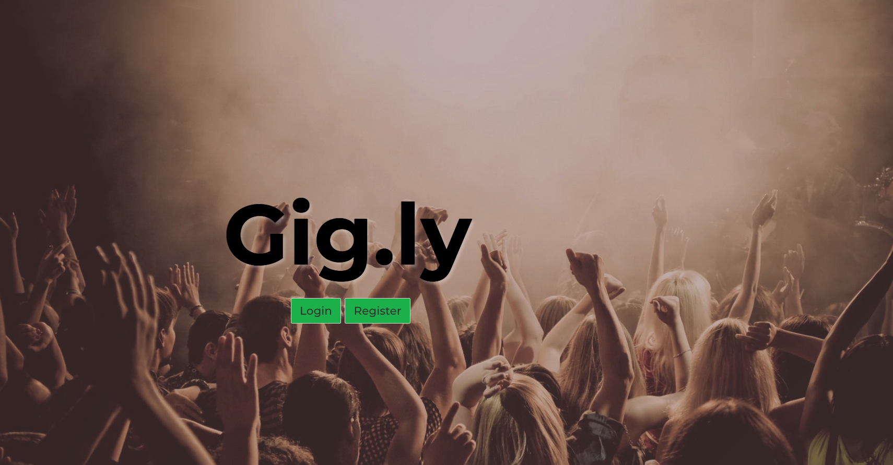

#  WDI Project 3: Group Project - 'Gig.ly'

Adding additional features to WDI_GROUP_PROJECT
Original project - **[https://gigly-wilson.herokuapp.com/](https://gigly-wilson.herokuapp.com/)**
Updated project - **[https://portfolio-group-project.herokuapp.com/](https://portfolio-group-project.herokuapp.com/)**

## SUMMARY

In my third project, I worked in a four person group project where our product was a social music event app designed for people to chat within groups attending upcoming gigs. Our application used a MEAN stack and combined three external API’s, pulling event information from Ticketmaster, playing relevant songs from Spotify and displaying the location for each event using Google Maps. The idea was that users would use the site to help plan their night using Google Map features as well as being a tool for people to recommend the artist's songs to others before the gig.

This was my first opportunity to working in team environment and it highlighted the importance of using project management tools such as Trello to keep the team aligned and informed of agile sprints. Features within the app were shared between the team and I was responsible for implementing and running the back end testing using Mocha and Chai. I also built the comments functionality and styled the section using a combination of Bulma and SASS.

### Programming and Technology Library:

* Mongo, Express, AngularJS, Node.js
* HTML5
* CSS3
* SASS / SCSS
* Bulma
* Mocha
* Chai
* Gulp
* TicketMaster API
* Google Maps API
* Spotify API
