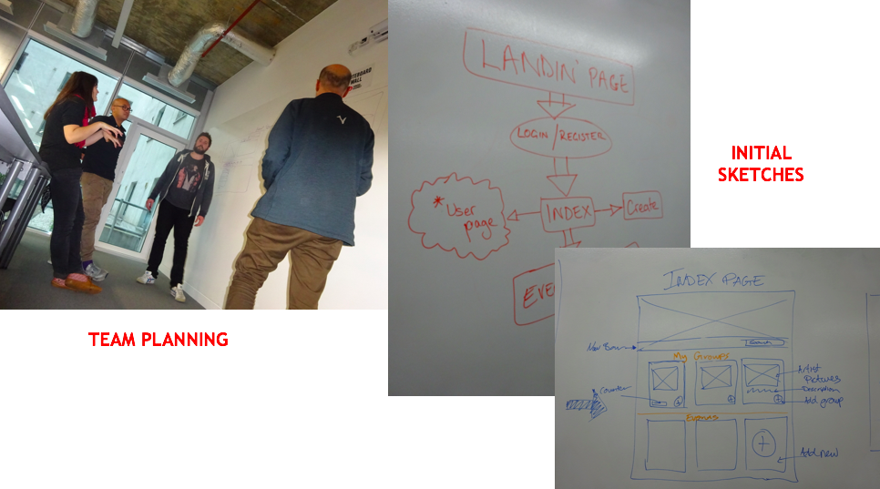
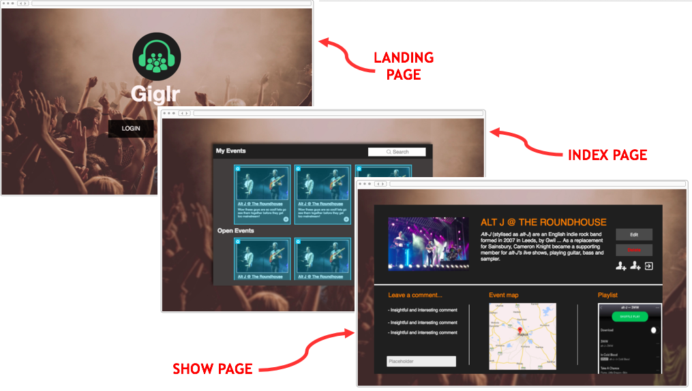
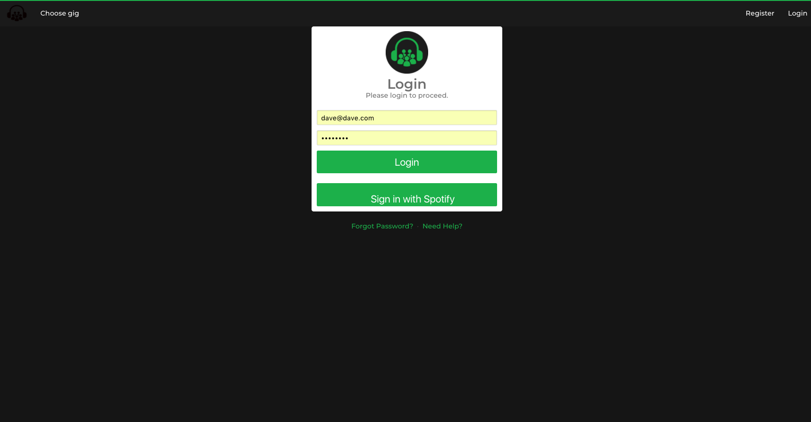
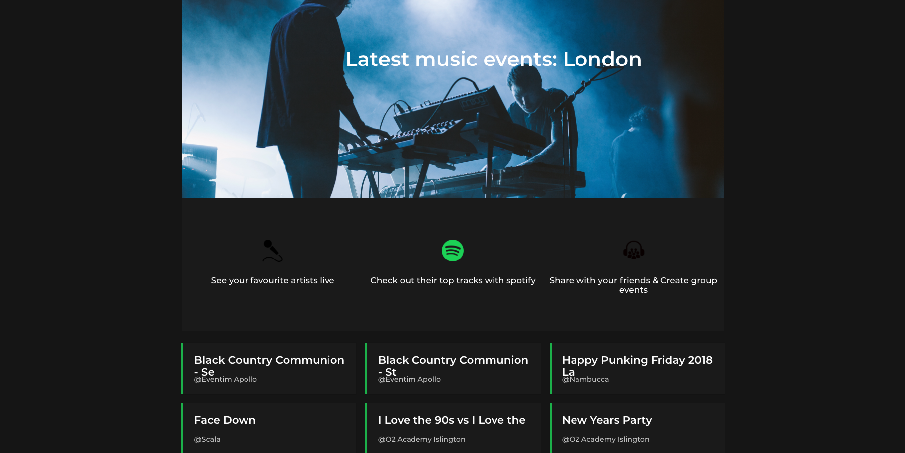
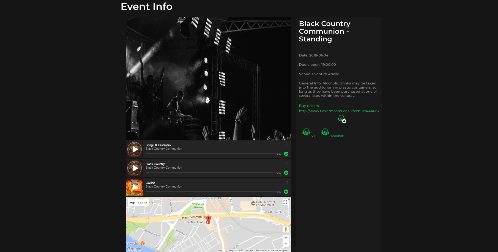
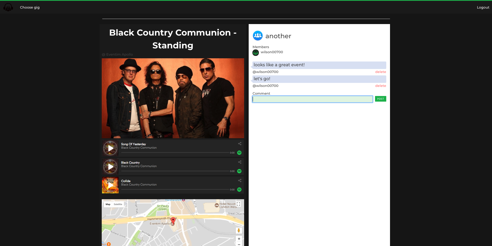
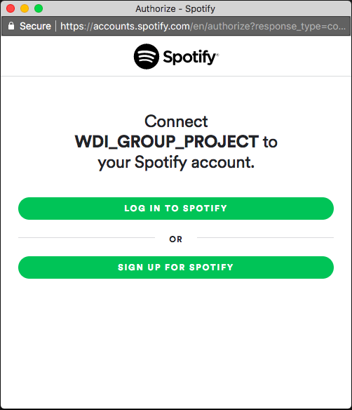
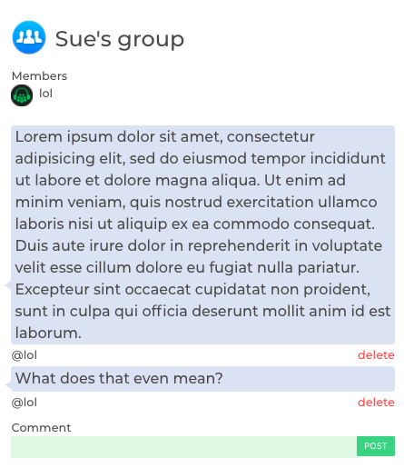
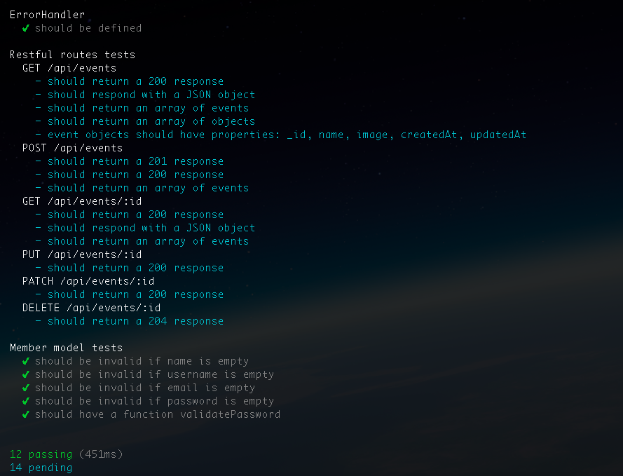

#  WDI Project 3: Group Project - 'Gig.ly'

**[https://gigly-wilson.herokuapp.com/](https://gigly-wilson.herokuapp.com/)**


## SUMMARY

In my third project, I worked in a four person group project where our product was a social music event app designed for people to chat within groups attending upcoming gigs. Our application used a MEAN stack and combined three external API’s, pulling event information from Ticketmaster, playing relevant songs from Spotify and displaying the location for each event using Google Maps. The idea was that users would use the site to help plan their night using Google Map features as well as being a tool for people to recommend the artist's songs to others before the gig.

This was my first opportunity to working in team environment and it highlighted the importance of using project management tools such as Trello to keep the team aligned and informed of agile sprints. Features within the app were shared between the team and I was responsible for implementing and running the back end testing using Mocha and Chai. I also built the comments functionality and styled the section using a combination of Bulma and SASS.

### Programming and Technology Library:

* Mongo, Express, AngularJS, Node.js
* HTML5
* CSS3
* SASS / SCSS
* Bulma
* Mocha
* Chai
* Gulp
* TicketMaster API
* Google Maps API
* Spotify API

## PLANNING
### Ideas Mapping & Group Planning
After being put into teams, 


> Figure 


### Wireframing and Prototyping
Once our team 


> Figure 


## FINAL APP
### Page Flow
It was decided that the.....



> Figure x - Register page


> Figure x - Events index page


> Figure x - Event show page


> Figure x - Group show page


### OAuth
On the initial login page, a user can either 


```js
function spotifyLogin(req, res, next) {
  var tokenUrl = 'https://accounts.spotify.com/api/token';
  var userUrl = 'https://api.spotify.com/v1/me';

  var params = {
    grant_type: 'authorization_code',
    code: req.body.code,
    redirect_uri: req.body.redirectUri
  };

  var headers = {
    Authorization:
      'Basic ' +
      new Buffer(req.body.clientId + ':' + oauth.SPOTIFY_SECRET).toString(
        'base64'
      )
  };
```

The modal belew appears once the 


> Figure x - 


## MY RESPONSIBILITIES
### Google Maps
pointer and lat / lng values

### Comments Section
create and delete


> Figure x - 


### Testing
To run the back end testing, I used Mocah and Chai

 

back end testing with Mocha and Chai




## STYLING
### Card Animations
changing on hover
### Mininal Colour Theme
stick to few colours and maintain through out


## LESSONS LEARNED

### Difficulties
1. git flow
2. Spotify app issues
3. styling classes duplication

### Project Successes
1. Managing to incorporate three different APIs and having them work together.
2. 

## FEATURES BACKLOG
1. Adding Google Places to the site to help users find out if there's restaurants/bars near the gig location.
2. Running more tests
