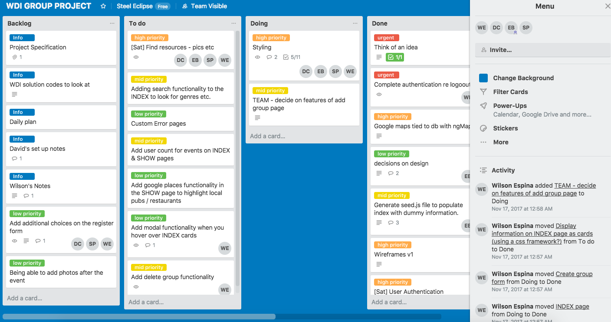

#  WDI Project 3: Group Project - 'Gig.ly'

**[https://gigly-wilson.herokuapp.com/](https://gigly-wilson.herokuapp.com/)**


## SUMMARY

In my third project, I worked in a four person group project where our product was a social music event app designed for people to chat within groups attending upcoming gigs. Our application used a MEAN stack and combined three external API’s, pulling event information from Ticketmaster, playing relevant songs from Spotify and displaying the location for each event using Google Maps. The idea was that users would use the site to help plan their night using Google Map features as well as being a tool for people to recommend the artist's songs to others before the gig.

This was my first opportunity to working in team environment and it highlighted the importance of using project management tools such as Trello to keep the team aligned and informed of agile sprints. Features within the app were shared between the team and I was responsible for implementing and running the back end testing using Mocha and Chai. I also built the comments functionality and styled the section using a combination of Bulma and SASS.

### Programming and Technology Library:

* Mongo, Express, AngularJS, Node.js
* HTML5
* CSS3
* SASS / SCSS
* Bulma
* Mocha
* Chai
* Gulp
* TicketMaster API
* Google Maps API
* Spotify API

## PLANNING

### Ideas Mapping & Group Planning
After being allocated into teams, we all went away to try to come up with idea for our group website. The next day we pitched our own ideas to each other until we settled on the social music sharing and event app. This was a theme I was particularly happy with as I've always wanted this exact type of app to exist for gigs or festivals that I go to.

Below are some initial wireframe sketches my team and I made when thinking about the flow of the website and the user's journey when navigating between pages.


> Figure 1 - Planning stage

### Trello Planning
Throughout the project, our team maintained a Trello board to help plan and track everyone's daily tasks. This was the first time I had used Trello within a group environment and I found being able to assign tasks to individual members was a great feature. Often during the project week, we would all be working on our own individual feautres and the Trello board made it much easier to see where we were as a team and what was due next. I found that when we were planning there seemed to be a fine balace between planning individual sprint in details and not being bogged down with too much detail, especially as we were all novice coders. As none of us had a full understanding of how long each task would take, it would not have been useful to plan things by the hour.


> Figure 2 - Trello board

### Wireframing and Prototyping
Once our team had a firm idea of our plan, what our site was about and the sort of features we wanted to include, we set about wireframing the pages using [Proto.io](https://proto.io/). This was the first time I had come across prototyping software and I found it incredibly useful to help visualise how someone would navigate around final website. As we had all agreed in the design and layout of the site at an early stage, it was also useful later on down the line during the styling phase.


> Figure 3 - Wireframes and prototypes created using proto.io

## FINAL APP
### Screenshots
Below are screenshots showing the final layout of our website. We decided to try to emulate the simple clean layout that you can find on the Spotify desktop app.


> Figure 4 - Register page


> Figure 5 - Events index page


> Figure 6 - Event show page


> Figure 7 - Group show page

### OAuth
On the initial login page, a user can choose to register their details and set up a login. However to get the Spotify functionality working on Event pages, a user can login with their Spotify account details.

The modal below appears once the users opts to login using their Spotify login:


> Figure 8 - Spotify login modal

The OAuth functionality is handled within a controller in the back end. Here, request-promise is used to send `POST` request to Spotify. Parameters such as the unique Spotify secret ID are included in the headers. Once the ID is authorised by Spotify,`request-promise` then handles a `GET` request which includes the encoded `access_token` from Spotify. This is stored in Local Storage within the browser and the tool that lets the website know that the user is authorised.

```js
function spotifyLogin(req, res, next) {

...

  var headers = {
    Authorization:
      'Basic ' +
      new Buffer(req.body.clientId + ':' + oauth.SPOTIFY_SECRET).toString(
        'base64'
      )
  };
  
...

  return new Promise((resolve, reject) => {
    rp({
      method: 'post',
      uri: tokenUrl,
      json: true,
      form: params,
      headers: headers
    })
      .then(body => {
        req.spotifyToken = body.access_token;

        return rp({
          method: 'GET',
          uri: userUrl,
          json: true,
          headers: {
            Authorization: 'Bearer ' + body.access_token
          }
        });
      })
```

### Proxy Request
In order to get event data back from the Ticketmaster API, we needed once again use `request-promise` to retrieve and handle operations in the back end.

Once we had registered our application on the ticketmaster developer [site](https://developer.ticketmaster.com/), we looked through the available documentation to work out how and what data we would need. According to the documentation, a series of query string just need to be added to the root URL to help define the data being requested. 

```js
function getEventData(req, res) {
  rp('https://app.ticketmaster.com/discovery/v2/events.json?countryCode=GB&classificationName=pop&classificationName=concertp&city=London&sort=date,asc&apikey=bbr8L0veZB9V45s6JSAf321OGwHhydvq')
    
...

}
```
The URL above had query strings which requested the following information from Ticketmaster:

* classificationName (X2) - Pop music & pop concerts
* city - London
* sort - Sort results by date in ascending order

### Ticketmaster API Data
An example of the JSON data received back from Ticketmaster is below. The information given is quite substantial which made it much easier to pad out our site with text and images. One particularly useful bit on information provided was the `latitude` and `longitude` figures from each event location. We later fed these numbers into the Google Maps API so that we could render a map around the specific location.


> Figure 9 - Ticketmaster API JSON data

## MY RESPONSIBILITIES
As this was a group project, we split up the tasks and listed them out on our Trello board. Each of us had invidual responsibilities and some of mine are listed below:

### Google Maps
One of my tasks was to integrate the Google Maps API so it would display the gig locations for individual events. This was done my making a `Custom Directive` which AngularJS allows you to do. Once set up, the directive can be called within the `views` files. The code below shows where the `latitude` and `longitude` figures are injected into the constructor function at the bottom. The reason for the 1000ms `$timeout` is to accomodate for asynchronous way that JavaScript works. Without this `$timeout`, the browser would try to render the map before it receives data and it would just display an error.

```js
function googleMap($window, $timeout) {
  return {
  
	...
	
    },
    link(scope, element) {
      $timeout(renderMap, 1000);
      function renderMap() {
        const latLng = {
          lat: parseFloat(scope.center.lat),
          lng: parseFloat(scope.center.lng)
        };

        map = new $window.google.maps.Map(element[0], {
          zoom: 16,
          center: latLng
        });
```

### Comments Section
I was also responsible for adding comments functionality to allow users to post and delete comments on the groups' show pages. Each comment needed to be associated to indivual `members` so these were included in comment and group schema (shown below). Every time a new comment was created, it had an associated `createdBy` object which referred to an embedded `Member`.

```js
const commentSchema = new mongoose.Schema(
  {
    content: { type: String, required: true },
    createdBy: { type: mongoose.Schema.ObjectId, ref: 'Member', required: true }
  },
  {
    timestamps: true
  }
);

...

const groupSchema = new mongoose.Schema({
  name: { type: String, trim: true, required: true },
 ...
  comments: [commentSchema]
});
```

As the comments section would be rendered on the righthand side of the page, I decided to stick to just using pure CSS to style the elements rather than using Bulma's layout. Each 'speech bubble' is just a `div` that wraps round the text in the comments and the `POST` button comes from the Bulma in-built style. I wanted to overall look to be quite simple and reflect the type of interface you would see on WhatsApp messenger.


> Figure 10 - Comments box example

### Testing

To run the back end testing, I used Mocha for the testing framework and Chai for the assertion library. This project was the first time I used *Test Driven Development* outside of the classroom. It was a new experience and an insight into using common industry techniques.

 

As we only had a limited time on the project, I wrote 12  successful tests and had a further 14 pending that I'll alter in the future.


> Figure 10 - Test output in Terminal


## LESSONS LEARNED

As with any project, there were a few issues that the team came across that we had to resolve along the way.

### Difficulties
1. **Working on the same code** - This was the first time any of our team had used GitHub to work on the same code at the same time. Becasue of this, it took a while to get used to the git flow where we would work on our own branches, push to the development branch and deal with merge conflicts. This was a great learning experience as it demonstrated the importance of communication and sharing exactly which parts of the code everyone's working on.
2. **Spotify app issues** - One of the main features that made part of our Minimum Viable Product (MVP), was to allow users to listen to songs through Spotify. Before we started coding, we were unaware that Spotify had recently updated the way OAuth works with their app. Unfortunately for us, they made it more difficult than they had previously and their documentation wasn't as detailed as it could be. This led to many more extra hours spent on this than we had planned, but ws a valuable experience in project planning and aloowing for these sorts of delays
3. **Duplicate classes affecting CSS styling** - When it came to the CSS styling phase, we all worked on separate pages and hadn't decided on a naming convention beforehand. This led to some duplicate class names and meant that we had top rework the code when merging everything. This added a delay in submitting our final product and meant it was really down to the wire for our final submission!
4. **Not understanding what the true MVP was** - At the start of the project, the original idea for the site was that users could use Spotify to recommend songs to each other before gigs/festivals. However when as the app developed, we pivotted on this idea and instead made the site load in a few songs from the relevant artist. There were a few other ideas we pivotted on along the way making it difficult to understand what we needed to acheive at a basic level. If we were to build the app again, I would definitely have recommended that we all agree as a team what the MVP would be at an early stage so we all know what we needed to produce and when.
5. **Deploying on Heroku** - When we reached the deployment phase, we found several issues when deploying to Heroku. This meant a fair amount of time having to correct bits of code that were flagged up in the CLI.

We also had several successes along the way and managed to provide a working app at the end of our project deadline.

### Project Successes
1. **Managing to incorporate three different APIs and having them work together** - We had 3 API's in total all working in conjunction with one another.
2. **Creating and running tests for the first time** - This was a great way to learn how to write tests and run them successfully on my own app.
3. **Maintaining a simple style throughout the site** - The final 
4. **Getting the Spotify API to work (in the end)** - Although we had problems with setting up Spotify, we eventually got it working.

## FEATURES BACKLOG
1. Adding Google Places to help users find out if there's restaurants/bars near the gig location.
2. Running more tests and correcting the 14 pending test that I had already written.
3. Add a customised favicon to the site.
4. Add an option for users to choose different event types, not just pop gigs in London.
