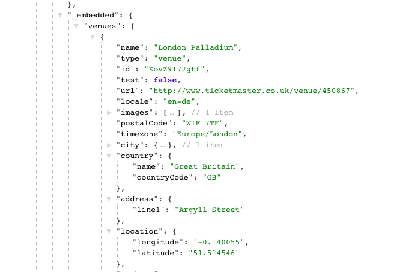

#  WDI Project 3: Group Project - 'Gig.ly'

**[https://gigly-wilson.herokuapp.com/](https://gigly-wilson.herokuapp.com/)**


## SUMMARY

In my third project, I worked in a four person group project where our product was a social music event app designed for people to chat within groups attending upcoming gigs. Our application used a MEAN stack and combined three external API’s, pulling event information from Ticketmaster, playing relevant songs from Spotify and displaying the location for each event using Google Maps. The idea was that users would use the site to help plan their night using Google Map features as well as being a tool for people to recommend the artist's songs to others before the gig.

This was my first opportunity to working in team environment and it highlighted the importance of using project management tools such as Trello to keep the team aligned and informed of agile sprints. Features within the app were shared between the team and I was responsible for implementing and running the back end testing using Mocha and Chai. I also built the comments functionality and styled the section using a combination of Bulma and SASS.

### Programming and Technology Library:

* Mongo, Express, AngularJS, Node.js
* HTML5
* CSS3
* SASS / SCSS
* Bulma
* Mocha
* Chai
* Gulp
* TicketMaster API
* Google Maps API
* Spotify API

## PLANNING

### Ideas Mapping & Group Planning
After being allocated into teams, we all went away to try to come up with idea for our group website. The next day we pitched our own ideas to each other until we settled on the social music sharing and event app. This was a theme I was particularly happy with as I've always wanted this exact type of app to exist for gigs or festivals that I go to.

Below are some initial wireframe sketches my team and I made when thinking about the flow of the website and the user's journey when navigating between pages.


> Figure 1 - Planning stage

### Wire-framing and Prototyping
Once our team had a firm idea of what our site was about and the sort of features we wanted to include, we set about wire-framing the pages using proto.io. This was the first time I had come across prototyping software and I found it incredibly useful to help visualise how someone would navigate around final website. As we had all agreed in the design and layout of the site at an early stage, it was also useful later on down the line during the styling phase.


> Figure 2 - Wireframes and prototypes created using proto.io

## FINAL APP
### Page Flow
Below are screenshot of the final layout of the website. 


> Figure x - Register page


> Figure x - Events index page


> Figure x - Event show page


> Figure x - Group show page


### OAuth
On the initial login page, a user can either 


```js
function spotifyLogin(req, res, next) {
  var tokenUrl = 'https://accounts.spotify.com/api/token';
  var userUrl = 'https://api.spotify.com/v1/me';

  var params = {
    grant_type: 'authorization_code',
    code: req.body.code,
    redirect_uri: req.body.redirectUri
  };

  var headers = {
    Authorization:
      'Basic ' +
      new Buffer(req.body.clientId + ':' + oauth.SPOTIFY_SECRET).toString(
        'base64'
      )
  };
```

The modal below appears once the 


> Figure x - 

### Proxy Request
In order to get event data back from the Tick

```js
function getEventData(req, res) {
  rp('https://app.ticketmaster.com/discovery/v2/events.json?countryCode=GB
&classificationName=pop
&classificationName=concertp
&city=London
&sort=date,asc
&apikey===bbr8L0veZB9V45s6JSAf321OGwHhydvq==')
    
...

}
```


### Ticketmaster API Data
JSON data back from Ticket Master


> Figure x - 


## MY RESPONSIBILITIES
### Google Maps
pointer and lat / lng values

```js
function googleMap($window, $timeout) {
  return {
  
	...
	
    },
    link(scope, element) {
      $timeout(renderMap, 1000);
      function renderMap() {
        const latLng = {
          lat: parseFloat(scope.center.lat),
          lng: parseFloat(scope.center.lng)
        };

        map = new $window.google.maps.Map(element[0], {
          zoom: 16,
          center: latLng
        });
```

### Comments Section
create and delete


> Figure x - 


### Testing
To run the back end testing, I used Mocha and Chai

 

back end testing with Mocha and Chai


## STYLING
### Card Animations
changing on hover

```css
._card {
  background-color: $almost-black;
  border-left: 4px solid $spotify-green;
  color: $white;
  &:hover {
    background-color: darken( $almost-black, 2% );
    border-left: 4px solid #DA22FF;
    cursor: pointer;
    }
```

### Minimal Colour Theme
stick to few colours and maintain through out

```js
// Colors
$spotify-green: #1db954;
$black: black;
$almost-black: #1C1C1C;
$white: white;
```


## LESSONS LEARNED

### Difficulties
1. git flow
2. Spotify app issues
3. styling classes duplication
4. Not understanding what the true MVP was 

### Project Successes
1. Managing to incorporate three different APIs and having them work together.
2. 

## FEATURES BACKLOG
1. Adding Google Places to the site to help users find out if there's restaurants/bars near the gig location.
2. Running more tests
